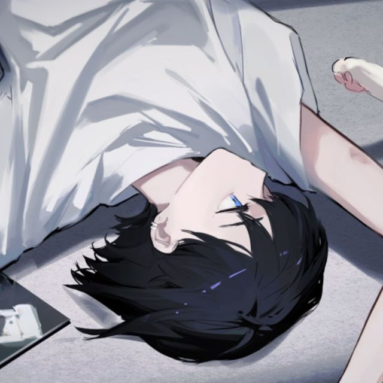

   

      
      

         

            

               
               

                  

                     <a rel="nofollow" href="https://kaze-kazuha.top/">Kazuha的博客 (博客已停运)</a>
                  

                  
注意: 此博客因服务器停止运行而关闭,仅留做纪念

               

            
 
         
        
         

            

               
               

                  

                     <a rel="nofollow" href="https://www.solitude21.cn">A Time Soliloquy</a>
                  

                  
大学牲,喜欢画画,游戏爱好者

               

            
 
         
        
        

            

               
               

                  

                     <a rel="nofollow" href="https://leoz.work">leoz.work</a>
                  

                  
Leo,中国科学院大学,软件工程

               

            
 
         
        
      

   

---

### 友情链接提交说明

* 您的网站已稳定运行，且有一定的文章量
* 原创、技术、设计类网站优先考虑
* 不收录有反动、色情、赌博等不良内容或提供不良内容链接的网站
* 您需要将本站链接放置在您的网站中

### 友情链接提交格式

* 网站链接: https://blog.mickeymiao.top
* 网站图标Url: https://blog.mickeymiao.top/images/avatar.png
* 网站名称: 米奇淼淼屋 MickeyMiao
* 个人/网站介绍: 保持独立思考,不卑不亢不怂